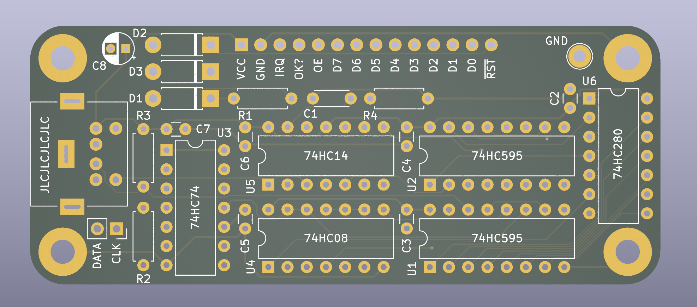
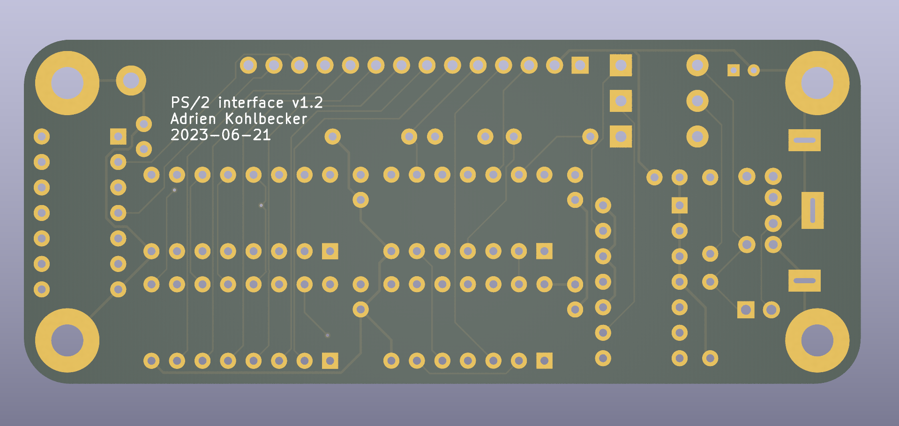

# PS/2 interface

## Board

## Schematic

## BOM

| Refs | Qty | Component | Description |
| ----- | --- | ---- | ----------- |
| C1 | 1 | 10nF | Unpolarized capacitor D4.3mm_W1.9mm_P5.00mm |
| C2, C3, C4, C5, C6, C7 | 6 | 0.1uF | Unpolarized capacitor D3.0mm_W1.6mm_P2.50mm |
| C8 | 1 | 10uF | Polarized capacitor D4.0mm_P2.00mm |
| D1, D2, D3 | 3 | 1N5817 | 20V 1A Schottky Barrier Rectifier Diode, DO-41 |
| J1 | 1 | Mini-DIN-6 | 6-pin Mini-DIN connector, EB-DIOS M06V |
| J2 | 1 | Conn_01x14 | Generic connector, single row, 01x14 |
| J3 | 1 | KBD | Generic connector, single row, 01x02 |
| R1 | 1 | 22k | Resistor DIN0207 |
| R2, R3, R4 | 3 | 10k | Resistor DIN0207 |
| TP3 | 1 | GND | test point D2.60mm_Drill1.6mm |
| U1, U2 | 2 | 74HC595 | 8-bit serial in/out Shift Register 3-State Outputs, DIP-16 |
| U3 | 1 | 74HC74 | Dual D Flip-flop, Set & Reset, DIP-14 |
| U4 | 1 | 74HC08 | Quad And2, DIP-14 |
| U5 | 1 | 74HC14 | Hex inverter schmitt trigger, DIP-14 |
| U6 | 1 | 74HC280 | Parity Generator/Checker, DIP-14 |
